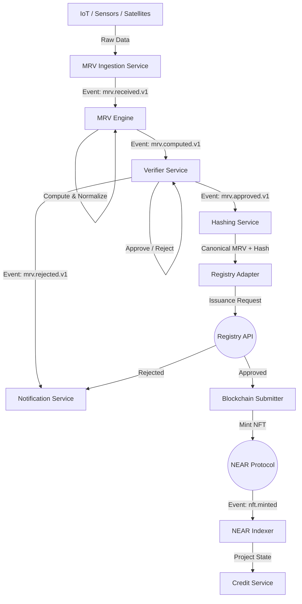

# Enterprise DMRV SaaS Platform

[](https://opensource.org/licenses/MIT)
[]()
[](https://near.org)

**A comprehensive, multi-tenant Digital MRV (Monitoring, Reporting, Verification) SaaS Platform for issuing and managing carbon credit NFTs on the NEAR blockchain.**

---

## 🚀 Project Overview

The Enterprise DMRV Platform is an event-driven microservices system designed to automate the lifecycle of carbon credits. From IoT sensor ingestion to blockchain serialization, it provides a transparent, auditable, and scalable solution for the voluntary and compliance carbon markets.

### Key Features
*   **Multi-Tenancy**: Built from the ground up to support multiple organizations with strict data isolation.
*   **Event-Driven Architecture**: Asynchronous communication using Kafka/NATS for high throughput and reliability.
*   **Blockchain Integration**: Native integration with NEAR Protocol for low-cost, high-speed NFT minting and retirement.
*   **Multi-Registry Support**: Adapters for Verra, Puro, Isometric, and EU ETS.
*   **Auditability**: Immutable audit logs and cryptographic proofs for all MRV data.

---

## 🏗️ Architecture

The platform is composed of **16+ microservices** organized into core business logic and external adapters.

### Core Services
*   **`api-gateway`**: Unified entry point for all client requests.
*   **`mrv-ingestion-service`**: High-volume ingestion from sensors and satellites.
*   **`mrv-engine`**: Computation engine for methodology application (e.g., VM0007).
*   **`blockchain-submitter`**: Manages nonces and transaction submission to NEAR.
*   **`verifier-service`**: Workflow management for third-party verification bodies (VVBs).

### Technology Stack
*   **Backend**: Node.js (TypeScript) / Go
*   **Smart Contracts**: Rust (NEAR SDK)
*   **Messaging**: Kafka / NATS JetStream
*   **Database**: PostgreSQL (TimescaleDB for time-series), Redis
*   **Infrastructure**: Kubernetes, Terraform, Docker

---

## � System Workflow

The following diagram illustrates the high-level data flow from sensor ingestion to on-chain credit issuance:



---

## �📂 Repository Structure

This is a **monorepo** containing all services, infrastructure code, and smart contracts.

```text
dmrv-saas-platform/
├── services/               # Microservices source code
│   ├── api-gateway/        # Authentication & Routing
│   ├── project-service/    # Project Metadata Management
│   ├── mrv-engine/         # Calculation Engine
│   └── ...                 # (See /services/README.md for full list)
├── smart-contracts/        # NEAR Rust contracts (NFT, Registry)
├── shared/                 # Shared libraries (Auth, Events, Types)
├── infrastructure/         # K8s manifest, Terraform, Helm charts
├── docs/                   # Architecture decision records & API specs
└── scripts/                # CI/CD and utility scripts
```

---

## 🛠️ Getting Started

### Prerequisites
*   [Docker](https://www.docker.com/) & Docker Compose
*   [Node.js](https://nodejs.org/) (v18+)
*   [Rust](https://www.rust-lang.org/) (for smart contracts)
*   [NEAR CLI](https://docs.near.org/tools/near-cli)

### Local Development Setup

1.  **Clone the repository**
    ```bash
    git clone https://github.com/your-org/dmrv-saas-platform.git
    cd dmrv-saas-platform
    ```

2.  **Install Dependencies**
    ```bash
    # Install root and service dependencies (assuming npm workspaces)
    npm install
    ```

3.  **Start Infrastructure (DB, Redis, Kafka)**
    ```bash
    cd infrastructure/docker-compose
    docker-compose up -d
    ```

4.  **Run Microservices**
    ```bash
    # Start all services in development mode
    npm run dev
    ```

---

## 🧪 Testing

*   **Unit Tests**: Run `npm test` in any service directory.
*   **E2E Tests**: located in `tests/e2e`.
*   **Contract Tests**: Run `cargo test` in `smart-contracts/`.

---

## 🤝 Contribution

1.  Create a feature branch (`git checkout -b feature/amazing-feature`).
2.  Commit your changes following [Conventional Commits](https://www.conventionalcommits.org/).
3.  Push to the branch (`git push origin feature/amazing-feature`).
4.  Open a Pull Request.

Please refer to `docs/CONTRIBUTING.md` for detailed guidelines.

---

## 📄 License

This project is licensed under the MIT License - see the [LICENSE](LICENSE) file for details.
